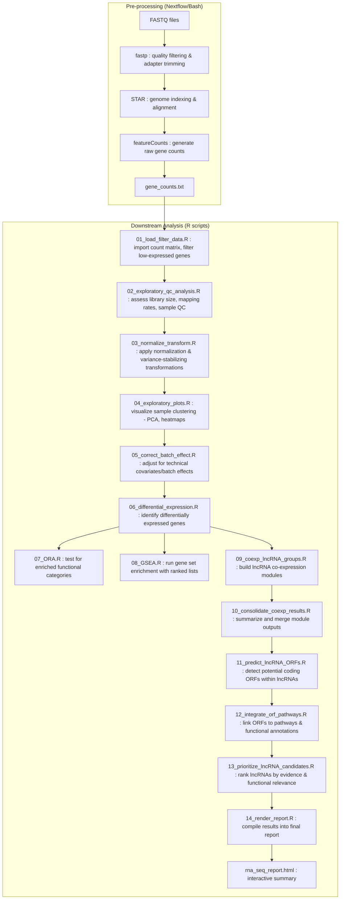

# RNA-seq Analysis Pipeline

This repository contains a complete RNA-seq analysis pipeline, including **quality control, trimming, genome indexing, alignment, and gene quantification**.  
The pipeline is implemented in **Nextflow** (with an optional Bash script) for data processing, and in **R** for downstream exploratory analysis, normalization, differential expression, and functional interpretation.  

The workflow supports execution with **local HPC modules** and optionally uses **Singularity or Docker containers** for reproducibility.


## Features

- **Processing pipeline**:
  - Reads trimming with **fastp**
  - Alignment using **STAR**
  - Gene quantification with **featureCounts**
  - Optional reuse of existing STAR genome indexes
- **Analysis pipeline in R**:
  - Quality control and exploratory analysis
  - Normalization and batch-effect correction
  - Differential expression analysis
  - Functional enrichment: **ORA & GSEA**
  - Co-expression analysis with **lncRNAs**
  - ORF prediction and pathway integration
  - Automated reporting in RMarkdown
- **Reproducibility**:
  - Runs on HPC with modules or containers (Singularity/Docker)
  - Predefined folder structure for input and output


## Repository Structure

```
rnaseq-pipeline/
├── Dockerfile                  # Container definition (fastp, STAR, featureCounts, Nextflow, R/renv)
├── README.md                   # Project documentation
├── nextflow.config             # Nextflow configuration (modules + fallback containers)
├── main.nf                     # Nextflow workflow implementation
├── run_pipeline.sh             # Optional Bash pipeline
├── samplesheet.csv             # Example input samplesheet
├── genome/                     # Reference genome FASTA + annotation
│   ├── GRCh38.primary_assembly.genome.fa
│   └── gencode.v48.primary_assembly.annotation.gtf
├── genome_index/               # STAR genome index (generated/reused)
├── fastq/                      # Raw FASTQ files
├── fastp_reports/              # fastp QC reports (.html, .json)
├── output/                     # Outputs from the processing pipeline
│   ├── trimmed/                # Trimmed FASTQ files
│   ├── aligned/                # BAM files from STAR
│   └── counts/                 # Gene counts (featureCounts)
├── results/                    # Downstream R analysis results
└── scripts/                    # R analysis scripts
├── 00_run_all_analysis.R
├── 01_load_filter_data.R
├── 02_exploratory_qc_analysis.R
├── 03_normalize_transform.R
├── 04_exploratory_plots.R
├── 05_correct_batch_effect.R
├── 06_differential_expression.R
├── 07_ORA.R
├── 08_GSEA.R
├── 09_coexp_lncRNA_groups.R
├── 10_consolidate_coexp_results.R
├── 11_predict_lncRNA_ORFs.R
├── 12_integrate_orf_pathways.R
├── 13_prioritize_lncRNA_candidates.R
├── 14_render_report.R
└── rna_seq_report.Rmd
```


## Usage

### 1. Build Docker image

```bash
docker build -t rnaseq_pipeline:latest
```
On HPC systems without Docker, Singularity images will be used automatically if configured in nextflow.config.


### 2. Run Bash pipeline (stable option)

```bash
docker run --rm -v /path/to/project:/data rnaseq_pipeline:latest \
           /bin/bash /data/run_pipeline.sh
```

### 3. Run Nextflow pipeline (beta)

```bash
nextflow run main.nf -c nextflow.config
```

Or with Docker:

```bash
docker run --rm -v /path/to/project:/data rnaseq_pipeline:latest \
           /opt/nextflow/nextflow run /data/main.nf -c /data/nextflow.config
```


### 4. Run downstream R analysis

Once the gene_counts.txt file is generated (from featureCounts), place it in the project root directory. Then run:

```bash
Rscript scripts/00_run_all_analysis.R
```

This will sequentially execute all scripts in /scripts and generate results in /results, plus the final report rna_seq_report.html.

## Workflow Overview




## Configuration

- Nextflow parameters: nextflow.config
- Bash pipeline parameters: at the top of run_pipeline.sh
- R dependencies: managed with renv (renv.lock included in the repo)

⸻

## Notes

- Existing STAR genome indexes are automatically reused if detected.
- Containers ensure reproducibility, but the pipeline works with HPC modules as well.
- The R pipeline produces:
- QC plots, PCA, clustering
- Differential expression tables
- ORA/GSEA enrichment results
- Co-expression networks and ORF predictions
- A final RNA-seq analysis report (rna_seq_report.html)
